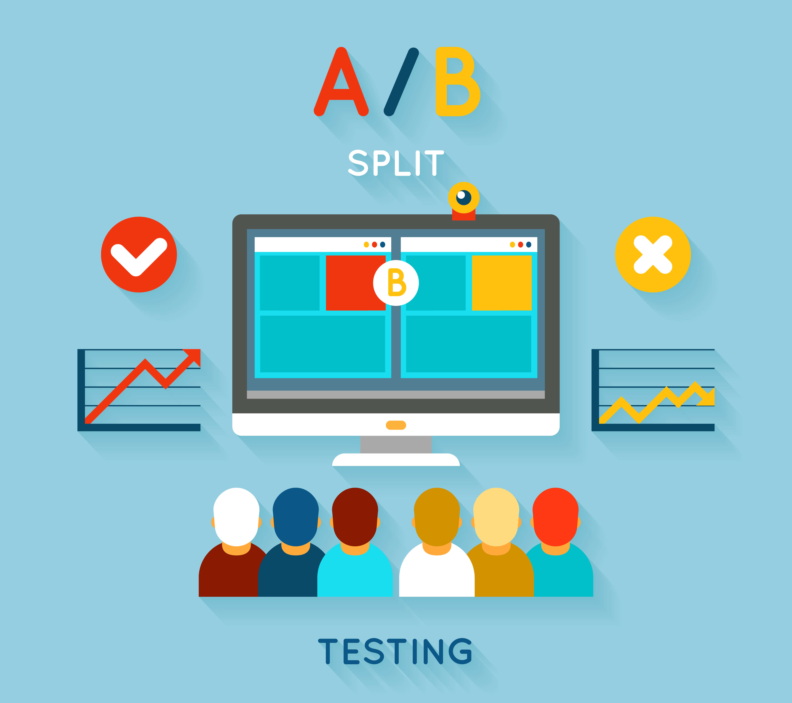

# Comparison of Conversion of Bidding Methods with AB Testing
AB Testing Homework of Miuul Data Science & Machine Learning Bootcamp

<a href="https://www.freepik.com/free-vector/ab-comparison-test-illustration_11062255.htm#page=2&query=ab%20testing&position=3&from_view=search&track=ais">Image by macrovector</a> on Freepik
 

## Business Case
Facebook recently introduced a new bidding type, 'average bidding', as an alternative to the existing bidding type called 'maximum bidding'. One of our clients, bombabomba.com, decided to test this new feature and would like to run an A/B test to see if average bidding converts more than maximum bidding. The A/B test has been going on for 1 month and now bombabomba.com is waiting for you to analyze the results of this A/B test. The ultimate success criterion for Bombabomba.com is Purchase. Therefore, the focus should be on the Purchase metric for statistical testing.

## Story of the Dataset
In this data set, which includes the website information of a company, there is information such as the number of advertisements that users see and click, as well as earnings information from here. There are two separate data sets, the control and test groups. These datasets are in separate sheets of the **ab_testing.xlsx** excel. **Maximum Bidding** was applied to the control group and **Average Bidding** was applied to the test group.

|Value| Description                                         |
|:----|:----------------------------------------------------|
|Impression| Views count of Ad                                   |
|Click| Number of clicks on the displayed ad                 |
|Purchase| Number of products purchased after ads clicked |
|Earning| Earnings after purchased products     |

## Project Tasks

---
1. **Data Prep and Analyse**
   1. Read the data set ab_testing_data.xlsx consisting of control and test group data. Assign control and test group data to separate variables
   2. Analyse control and test group data.
   3. After analyse process, merge control and test group using concat method
---
2. **Defining the AB Test Hypothesis**
    1. Define the hypothesis.
     
    H0 : M1 = M2
     
    H1 : M1!= M2 
   2. Analyze the purchase averages for the control and test group.
---
3. **Performing Hypothesis Testing**
    1. Perform hypothesis checks before hypothesis testing
     
    These are Assumption of Normality and Homogeneity of Variance. Test separately whether the control and test groups comply with the normality assumption, over the Purchase variable.
      
    **Normality Assumption** : H0: Normal distribution assumption is provided.  H1: The assumption of normal distribution is not provided. p < 0.05 H0 REJECT, p > 0.05 H0 CANNOT REJECT Is the assumption of normality according to the test result provided for the control and test groups? Interpret the p-values obtained.
      
    **Variance Homogeneity** : H0: Variances are homogeneous. H1: Variances are **not** homogeneous.  p < 0.05 H0 REJECT, p > 0.05 H0 **CANNOT** REJECT  Test whether the homogeneity of variance is provided for the control and test groups over the Purchase variable..  Is the assumption of normality provided according to the test result? Interpret the p-values obtained. 
    2. Select the appropriate test according to the Normality Assumption and Variance Homogeneity results
    3. Considering the p_value obtained as a result of the test, interpret whether there is a statistically significant difference between the purchasing averages of the control and test groups.
---
4. **Analysis of Results**
    1. Which test did you use, state the reasons.
    2. Advise the customer according to the test results you have obtained.

---
